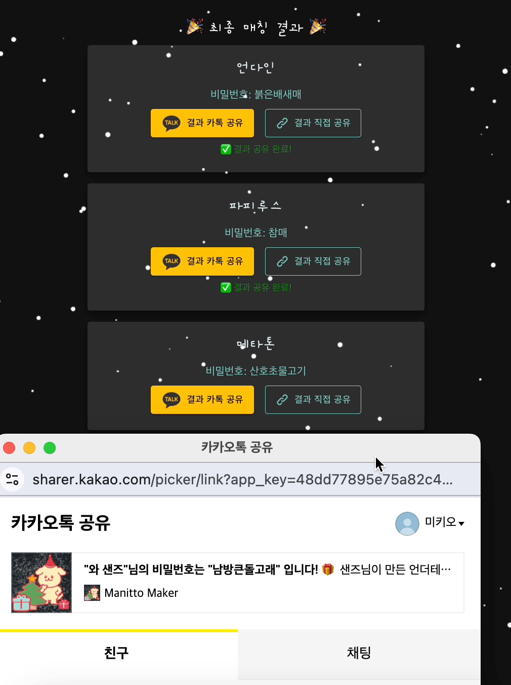

# 마니또 메이커

온라인으로 친구들과 마니또를 뽑고 비밀스러운 선물을 준비해보세요. 마니또 메이커는 앱 다운로드나 회원가입 없이 간편하게 사용할 수 있는 웹사이트입니다.

## 기능

- **간편한 그룹 생성**: 리더 이름과 그룹 이름만으로 빠르게 그룹을 생성할 수 있습니다.
  
- **구성원 추가**: 생성된 그룹에 구성원을 추가하고 수정할 수 있습니다.
  
  
- **비밀번호 관리**: 구성원 각각에게 할당된 비밀번호로 비밀스러운 마니또 뽑기를 진행합니다.
  
- **카톡 공유**: 매칭 결과를 카카오톡을 통해 간편하게 공유할 수 있습니다.
  
- **결과 확인**: 개별 구성원들이 자신의 이름과 비밀번호로 결과를 확인할 수 있습니다.
  
- **기존 결과 확인**: 리더 권한으로 비밀번호 유실 시 재확인 가능합니다.
  

## 사용 방법

1. **[마니또 메이커](https://manittomaker.com) 접속**
2. **그룹 생성**:
   - 리더 이름과 그룹 이름 입력 후 '그룹 생성' 버튼 클릭.
3. **구성원 추가**:
   - 구성원의 이름 입력 후 저장.
   - 연필 모양 아이콘을 클릭하여 구성원 이름 수정 가능.
4. **매칭 시작**:
   - '매칭 시작' 버튼 클릭 후 카톡 공유 버튼이나 URL 공유하기 버튼을 사용하여 결과 공유.
5. **결과 확인**:
   - 각 구성원은 자신의 이름과 비밀번호로 결과 페이지에서 확인 가능.
   - 리더는 '기존 마니또 결과 확인하기' 버튼을 통해 전체 결과 확인 가능.

즐거운 연말을 마니또 메이커와 함께 보내세요!
